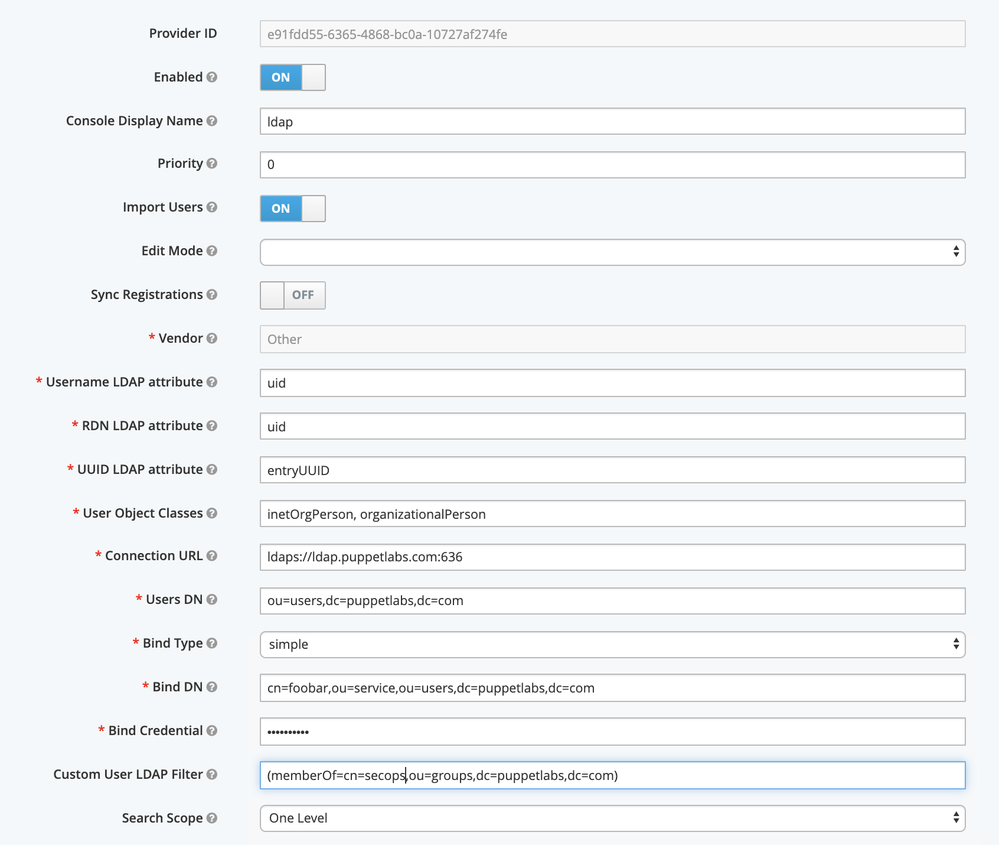
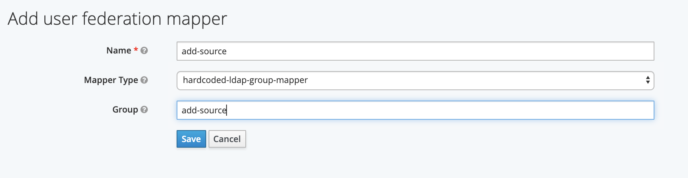
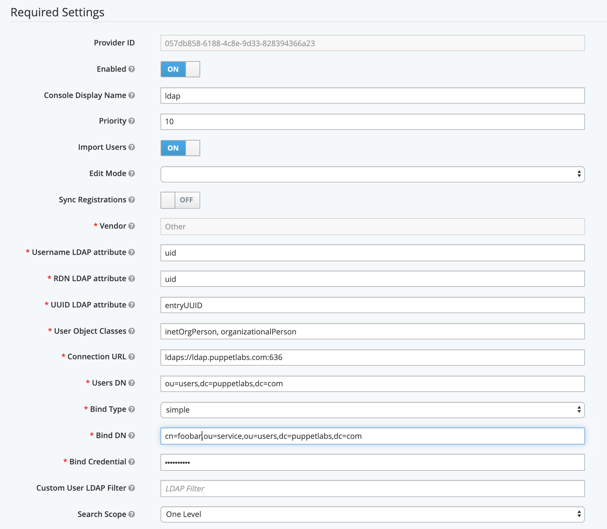

# Work with user groups in Remediate

Puppet Remediate provides a limited number of roles that allow you to control what users can and can’t do.

The following permission groups are available to add to accounts:

|Permission Group|Description|
|----------------|-----------|
|add-credential|Add access credentials for a node.|
|add-source|Add a vulnerability scanner or infrastructure source.|
|add-task|Add a new remediation task.|
|remove-credential|Remove access credentials for a node.|
|remove-source|Remove a vulnerability scanner or infrastructure source.|
|remove-task|Remove a new remediation task.|
|run-task|Run a remediation task.|

When using LDAP, you may want to grant a certain user group full permissions but restrict other user groups to more limited permissions.

This following example describes a sample scenario. It shows how to grant everyone in the LDAP group called *secops* full permissions, while letting all other users just run tasks.

To achieve this, we'll configure 2 LDAP providers with default mappers, and assign a different priority to each provider.

1.  In the main Remediate UI, click **User admin** on the navigation sidebar.

    The user admin login page is displayed.

2.  Log in with the administrator username and password.

3.  On the sidebar, click **User Federation** and select *ldap* from the drop-down list.

4.  Create an LDAP Provider for the *secops* user group:

    1.  Set the **Priority** to 0. This is the highest priority.

    2.  Specify a **Custom User LDAP Filter** that only includes members of *secops*. As in the following example:

    

    For a full step-by-step guide to creating an LDAP provider, see **LDAP configuration** in the related information section at the bottom of this page.

5.  Click **Save** when you are done.

6.  Next, create default mappers for each default permissions group you want to assign to the *secops* user group.

    This example shows a mapper for the add-source permission: group:

    

    For a full step-by-step guide to creating a default mapper, see **Adding LDAP mappers**.

7.  Create an LDAP Provider for all other users:

    1.  Set the **Priority** to 10. This number must be lower than 0 so that users are evaluated initially against the first LDAP provider, and then only this provider if they are not members of the *secops* LDAP group.

        

        For a full step-by-step guide to creating an LDAP provider, see **LDAP configuration** in the related information section at the bottom of this page.

    2.  Add default mapper for this second group to let all users run tasks by default. As in the following example:

        

        For a full step-by-step guide to creating a default mapper, see **Adding LDAP mappers**in the related information section at the bottom of this page.

**Parent topic:**[Managing user access](managing_user_access.md)

**Related information**  

[LDAP configuration](rem-cfg-ldap.md)

[LDAP mappers](rem-ldap-mappers.md#)

